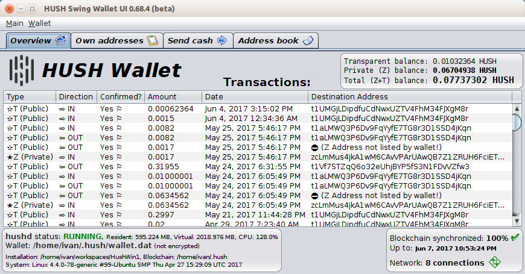

# [HUSH](https://myhush.org/) Desktop GUI Wallet

This application provides a Graphical User Interface (GUI) for the [HUSH](https://myhush.org/) (formerly Zdash) client tools that acts as a wrapper and presents the information in a more user-friendly manner.




## Building, installing and running the Wallet GUI

Before installing the Desktop GUI Wallet you need to have HUSH up and running. The following [guide](https://github.com/MyHush/hush/blob/master/README.md) explains how to set up [HUSH (formerly Zdash)](https://myhush.org/). 

**For security reasons it is recommended to always build the GUI wallet program from GitHub**
**[source](https://github.com/MyHush/hush-swing-wallet-ui/archive/master.zip).**
The details of how to build it are described below (easy to follow). 

1. Operating system and tools

   As of May 2017 (HUSH v1.0.9) this program is mostly tested on Linux. The Linux tools you need 
   to build and run the Wallet GUI are Git, Java (JDK7 or later) and Ant. If using Ubuntu Linux, 
   they may be installed via command: 
   ```
   user@ubuntu:~/build-dir$ sudo apt-get install git default-jdk ant
   ``` 
   For RedHat/CentOS/Fedora-type Linux systems the command is (like):
   ```
   user@centos:~/build-dir$ sudo yum install java-1.8.0-openjdk git ant 
   ```
   The name of the JDK package (`java-1.8.0-openjdk`) may vary depending on the Linux system, so you need to
   check it, if name `java-1.8.0-openjdk` is not accepted.
   If you have some other Linux distribution, please check your relevant documentation on installing Git, 
   JDK and Ant. The commands `git`, `java`, `javac` and `ant` need to be startable from command line 
   before proceeding with build.

2. Building from source code

   As a start you need to clone the hush-swing-wallet-ui Git repository:
   ```
   user@ubuntu:~/build-dir$ git clone https://github.com/MyHush/hush-swing-wallet-ui.git
   ```
   Change the current directory:
   ```
   user@ubuntu:~/build-dir$ cd hush-swing-wallet-ui/
   ```
   Issue the build command:
   ```
   user@ubuntu:~/build-dir/hush-swing-wallet-ui$ ant -buildfile ./src/build/build.xml
   ```
   This takes a few seconds and when it finishes, it builds a JAR file `./build/jars/HUSHSwingWalletUI.jar`. 
   You need to make this file executable:
   ```
   user@ubuntu:~/build-dir/hush-swing-wallet-ui$ chmod u+x ./build/jars/HUSHSwingWalletUI.jar
   ```
   At this point the build process is finished the built GUI wallet program is the JAR 
   file `./build/jars/HUSHSwingWalletUI.jar`

3. Installing the built HUSH GUI wallet

  3.1. If you have built HUSH from source code:

   Assuming you have already built it from source code in directory `/home/user/hush/src` (for 
   example - this is the typical build dir. for HUSH v1.0.8) which contains the command line tools `hush-cli` 
   and `hushd` you need to take the created file `./build/jars/HUSHSwingWalletUI.jar` and copy it 
   to directory `/home/user/hush/src` (the same dir. that contains `hush-cli` and `hushd`). Example copy command:
   ```
   user@ubuntu:~/build-dir/hush-swing-wallet-ui$ cp ./build/jars/HUSHSwingWalletUI.jar /home/user/hush/src    
   ```

4. Running the installed HUSH GUI wallet

   Before running the GUI you need to start hushd (e.g. `hushd --daemon`). The wallet GUI is a Java program packaged 
   as an executable JAR file. It may be run from command line or started from another GUI tool (e.g. file manager). 
   Assuming you have already installed HUSH and the GUI Wallet `HUSHSwingWalletUI.jar` in 
   directory `/home/user/hush/src` one way to run it from command line is:
   ```
   user@ubuntu:~/build-dir/hush-swing-wallet-ui$ java -jar /home/user/hush/src/HUSHSwingWalletUI.jar
   ```
   If you are using Ubuntu (or similar ;) Linux you may instead just use the file manager and 
   right-click on the `HUSHSwingWalletUI.jar` file and choose the option "Open with OpenJDK 8 Runtime". 
   This will start the HUSH GUI wallet.
   
   **Important:** the HUSH configuration file `~/.hush/hush.conf` needs to be correctly set up for the GUI
    wallet to work. Specifically the RPC user and password need to be set in it like:
    ```
    rpcuser=username
    rpcpassword=wjQOHVDQFLwztWp1Ehs098LKJHAXjd4E
    
    ``` 


### Donations accepted

At the present time this project is non-commercial in nature and developed by volunteers. If you find the GUI
Wallet useful, please consider making a donation for its further development. Your contribution matters! Donations 
are accepted at HUSH T address:
```
t1UDhNq2aEqvxEbPzcRM8n2QJV8YJ664rXJ
```


### License

This program is distributed under an [MIT License](LICENSE).


### Known issues and limitations

1. Issue: Wallet versions 0.58 and below, when running on systems with (typically non-western) locales that
redefine the decimal point in the OS locale settings, have problems with updating the GUI wallet state. 
A workaround is to change the [locale settings](https://windows.lbl.gov/software/optics/5-1-2/Optics4.jpg) to have dot as decimal separator.
2. Limitation: Wallet encryption has been temporarily disabled in all ZCash forks due to stability problems. A corresponding issue 
[#1552](https://github.com/zcash/zcash/issues/1552) has been opened by the ZCash developers. Correspondingly
wallet encryption has been temporarily disabled in the Hush Desktop GUI Wallet.
3. Issue: the GUI wallet does not work correctly if hushd is started with a custom data directory, like:
`hushd -datadir=/home/data/whatever` This will be fixed in later versions.
4. Issue: GUI data tables (transactions/addresses etc.) allow copying of data via double click but also allow editing. 
The latter needs to be disabled. 
5. Limitation: The list of transactions does not show all outgoing ones (specifically outgoing Z address 
transactions). A corresponding issue [#1438](https://github.com/zcash/zcash/issues/1438) has been opened 
for the ZCash developers. 
6. Limitation: The CPU percentage shown to be taken by hushd on Linux is the average for the entire lifetime 
of the process. This is not very useful. This will be improved in future versions.
