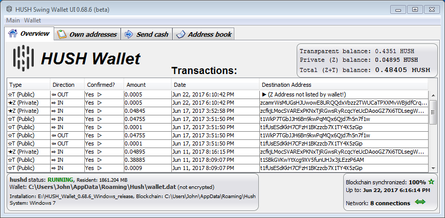

## [HUSH](https://myhush.org/) Desktop GUI Wallet binary release 0.68.6 for Windows

This is a [HUSH](https://myhush.org/) Desktop GUI Wallet binary release 0.68.6 for Windows. 
It requires a 64-bit Windows 7 or later version to run. It also includes 
[HUSH 1.0.9 binaries](https://zcash.dl.mercerweiss.com/hush-win-v1.0.9.zip) by 
[@radix42](https://github.com/radix42). 



### Installing the HUSH Desktop GUI Wallet on Windows

1. Download the Wallet ZIP file 
[HUSH_Wallet_0.68.6_Windows_release.zip](https://zcash.dl.mercerweiss.com/HUSH_Wallet_0.68.6_Windows_release.zip). 

2. Security check: You may decide to run a virus scan on it, before proceeding... In addition using a tool 
such as [http://quickhash-gui.org/](http://quickhash-gui.org/) you may calculate the its SHA256 checksum. The 
result should be:
```
369bbbeb5ce5327fc12532a1ae66f69f48b1bb3eb18e8bc7b6d11b34c8969cf3  HUSH_Wallet_0.68.6_Windows_release.zip
```
**If the resulting checksum is not `369bbbeb5ce5327fc12532a1ae66f69f48b1bb3eb18e8bc7b6d11b34c8969cf3` then**
**something is wrong and you should discard the downloaded wallet!**

3. Unzip the Wallet ZIP file HUSH_Wallet_0.68.6_Windows_release.zip in some directory that it will run from.
   
### Running the HUSH Desktop GUI Wallet on Windows

Double click on `HUSHSwingWalletUI.exe`. On first run (only) the wallet will download the cryptographic keys 
(900MB or so). In case of problems logs are written in `%LOCALAPPDATA%\HUSHSwingWalletUI\` for diagnostics.

**Important:** The HUSH Node 1.0.9 uses as a data directory `%APPDATA%\Hush` for its wallet and blcok-chain. 
If you have a previous version (1.0.8 or lower), the wallet and block-chain for the older version resided in 
`%APPDATA%\Zdash`. They will thus not be automatically used for the new version but may be copied manually
for this. It is sufficient to rename (or copy) the old directory `%APPDATA%\Zdash` to `%APPDATA%\Hush` for it
to be used by the new version.

**Important:** Some users have experienced network peer discovery issues after running the 
[HUSH](https://myhush.org/) Desktop GUI Wallet binary release 0.68.6 for Windows. The wallet would start but
would have zero network connections for up to 30-40 minutes until the first connection is found. This happens
only on the first run of the wallet (typically). The problem lies not in the wallet itself but in some 
(temporary) issues with the DNS seeding nodes in the HUSH network. As of 22 June 2017 HUSH core developers are 
aware of this and will address the issue but it might take a few days. Until then one manual workaround, for 
users who experience this and do not wish to wait for extended time periods, is to edit the HUSH configuration 
file `%APPDATA%\Hush\hush.conf` and add the addresses of nodes to connect to without automatic discovery. For
instance the following list of nodes may be added, to avoid the problem (copy the block of text and paste it 
into the file `%APPDATA%\Hush\hush.conf`): 


```
addnode=5.255.90.216
addnode=91.121.66.187
addnode=76.188.211.191
addnode=54.208.179.148
addnode=86.105.54.111
addnode=95.110.191.147
addnode=78.205.33.15
addnode=89.238.202.110
addnode=213.148.176.232
addnode=212.237.21.229
addnode=158.69.245.58
addnode=88.99.226.231
addnode=213.227.218.131
addnode=192.99.3.29
addnode=192.81.212.116
addnode=78.94.32.197
addnode=88.99.199.93
addnode=188.138.1.237
addnode=184.164.129.202
addnode=78.46.96.181
addnode=37.187.167.145
addnode=94.224.110.107
addnode=78.46.145.205
addnode=187.176.126.29
addnode=134.106.74.227
```

The Windows environment variable `%APPDATA%` typically points to `C:\Users\Your_Windows_User_Name\AppData\Roaming`, 
so if your Windows user-name is Joe, the full directory may be C:\Users\Joe\AppData\Roaming\Hush. To find out 
where `%APPDATA%` is, open a Windows explorer and type `%APPDATA%` and press Enter in its file location box... 


### Disclaimer

THE SOFTWARE IS PROVIDED "AS IS", WITHOUT WARRANTY OF ANY KIND, EXPRESS OR
IMPLIED, INCLUDING BUT NOT LIMITED TO THE WARRANTIES OF MERCHANTABILITY,
FITNESS FOR A PARTICULAR PURPOSE AND NONINFRINGEMENT. IN NO EVENT SHALL THE
AUTHORS OR COPYRIGHT HOLDERS BE LIABLE FOR ANY CLAIM, DAMAGES OR OTHER
LIABILITY, WHETHER IN AN ACTION OF CONTRACT, TORT OR OTHERWISE, ARISING FROM,
OUT OF OR IN CONNECTION WITH THE SOFTWARE OR THE USE OR OTHER DEALINGS IN THE
SOFTWARE.

### Known issues and limitations
1. In rare cases users have [reported problems](https://github.com/vaklinov/hush-swing-wallet-ui/issues/1)
when running the GUI wallet using certain ATI video drivers/cards. If such a problem is encountered then a 
user may run `HUSHSwingWalletUI.jar` instead of `HUSHSwingWalletUI.exe`. This JAR file will be runnable 
only if there is a Java JDK installed separately on the system. To install JDK 8 for Windows you may use 
this [good tutorial](http://www.wikihow.com/Install-the-Java-Software-Development-Kit)
1. Issue: GUI data tables (transactions/addresses etc.) allow copying of data via double click but also allow editing. 
The latter needs to be disabled. 
1. Limitation: The list of transactions does not show all outgoing ones (specifically outgoing Z address 
transactions).  
